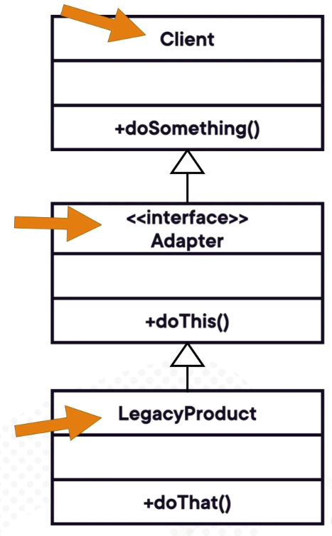

# Adapter

The Adapter Design Pattern is a structural design pattern that allows objects with incompatible interfaces to work together. 
It acts as a bridge between two incompatible systems, enabling their interaction without changing their existing code.

Key Features of the Adapter Pattern:
- Purpose: Converts the interface of a class into another interface that a client expects.
- Use Case: Useful when you need to integrate new functionality into an existing system but the new functionality's interface does not match the existing system's interface.
- Implementation: Typically involves creating a wrapper class (the adapter) that translates the interface of one class into a format compatible with another.

## Example

It is not mandatory that the adapter pattern must be implemented using an interface. It can also be implemented using a class.

Here is an example of the Adapter Design Pattern implemented using a class:

```java
public class AdapterEverydayDemo {

	public static void main(String[] args) {
		
		Integer[] arrayOfInts = new Integer[] { 42, 43, 44 };
		
		List<Integer> listOfInts = Arrays.asList(arrayOfInts);
		
		System.out.println(Arrays.toString(arrayOfInts));
		
		System.out.println(listOfInts);
		
	}
}
```

Here is an example of the Arrays.asList method that is an adapter to convert an array of something into a list from the Collections API.

## Design Considerations

Components of the Adapter Pattern:
- Adaptee:
The existing class that needs adapting.
- Adapter:
The class that implements the target interface and translates requests from the client to the adaptee.
- Client:
The object that interacts with the target interface.



## Example in Practice: Employee Adapter

If you check the code in this repository, you will find a real-world example of the Adapter Design Pattern in the `adapter` directory.
- Client : [EmployeeClient.java](src/main/java/org/java/tutorial/EmployeeClient.java)
- Adapter : [EmployeeAdapterLdap.java](src/main/java/org/java/tutorial/EmployeeAdapterLdap.java)
- Adaptee : [EmployeeLdap.java](src/main/java/org/java/tutorial/legacy/EmployeeLdap.java)

## Pros and Cons

Advantages:
- Promotes reusability by allowing integration of existing systems with new ones.
- Reduces the need for changes in existing client code.
- Simplifies the replacement of legacy systems.

Disadvantages:
- Can increase code complexity due to additional layers.
- May impact performance if not implemented efficiently.

## When to Use
- When there’s a need to use an existing class, but its interface does not match the one you need.
- When creating a reusable library that should work with other systems with different interfaces.
