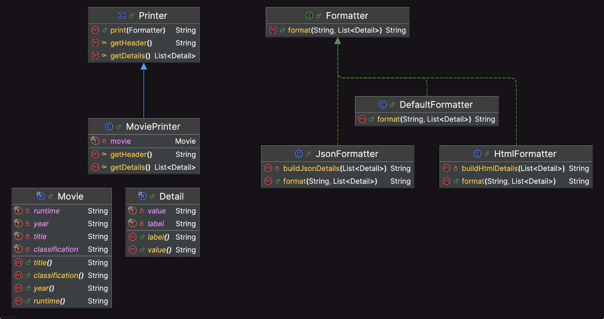

# Bridge

The bridge pattern is very similar to the adapter with the main difference being that the bridge works with new code, whereas, the adapter works with legacy code.

The bridge pattern is a structural design pattern that decouples an abstraction from its implementation so that the two can vary independently. 
It involves an interface that acts as a bridge that makes the functionality of concrete classes independent from interface implementers. The bridge pattern is useful when both the abstraction and the implementation need to be extended independently.

Check the problem of Shape and Color in this article :
- https://refactoring.guru/design-patterns/bridge

Key Features of the Bridge Pattern:
- Purpose: Separates the abstraction (high-level logic) from its implementation (low-level details) so they can be developed independently.
- Use Case: Used when you need to avoid a strong binding between an abstraction and its implementation.
- Implementation: Involves creating two class hierarchies:
  - One for the abstraction.
  - One for the implementation. These hierarchies are connected via a "bridge."

## Design Considerations

Components of the Bridge Pattern:
- Abstraction:
  - Defines the high-level interface and contains a reference to the implementor.
  - Can include methods that rely on the implementor for functionality.
- Refined Abstraction:
  - Extends the abstraction and adds more specific features.
- Implementor:
  - Defines the low-level interface that the abstraction uses.
- Concrete Implementor:
  - Implements the low-level details defined by the implementor interface.

## Example in Practice

You can check the Shape and Color example in this repository to see the Bridge Design Pattern in action :
- [shapes](src/main/java/org/java/tutorial/bridge/shapes)

Or the Movies example also : 
- [movies](src/main/java/org/java/tutorial/bridge/movies)

## Pros and Cons

Advantages:
- Decoupling:
  - Separates abstraction and implementation, enabling changes to either without affecting the other.
- Flexibility:
  - Allows switching or adding implementations without modifying abstractions.
- Scalability:
  - Both abstraction and implementation can be extended independently.

Disadvantages:
- Increased Complexity:
  - The pattern introduces additional layers, which may complicate the design.
- Overhead:
  - May add slight performance overhead due to indirection.

## When to Use:
- When you have multiple dimensions of variation (e.g., abstraction and implementation) and want to avoid combinatorial explosion of subclasses.
- When abstraction and implementation need to evolve independently.

## References
- https://app.pluralsight.com/ilx/video-courses/clips/9c4d8578-dac8-480a-88dd-1d8107f16e02
- https://refactoring.guru/design-patterns/bridge